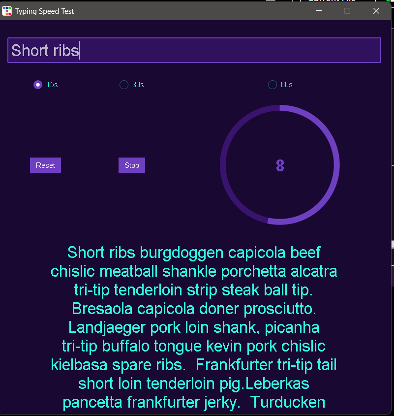

# Tpying Speed Test built using Python
## Simple Typing Speed Test built using ttkbootstrap 

* 3 time modes
* Random text generated using API

## How to install
Simply run the "Typing Speed Test.exe" file or open the python files in your IDE and
install the reuqired modules using the "requirements.txt" file.

## Find a big?
Feel free to use the tab above if you come across a bug.
